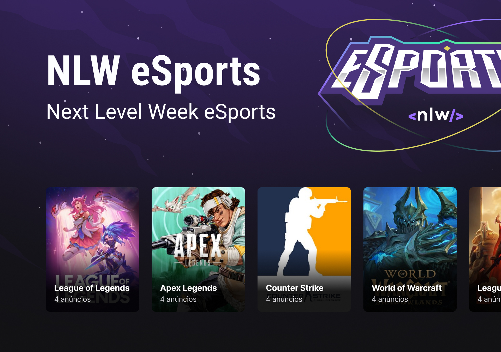
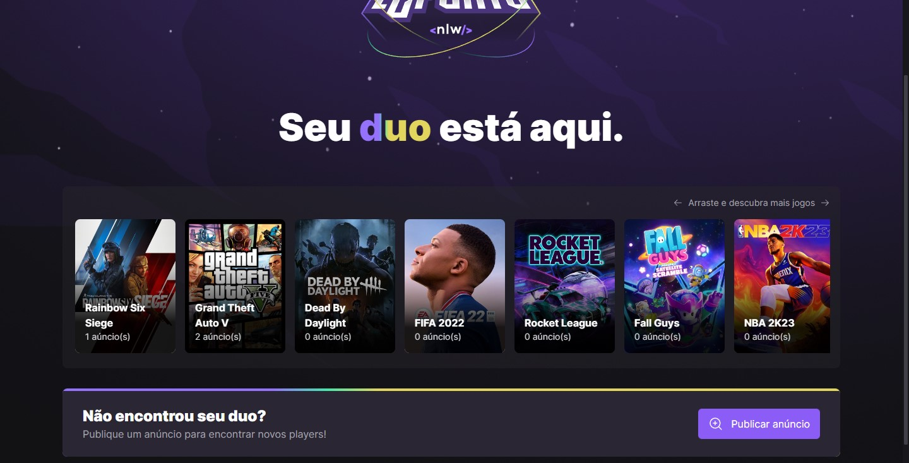
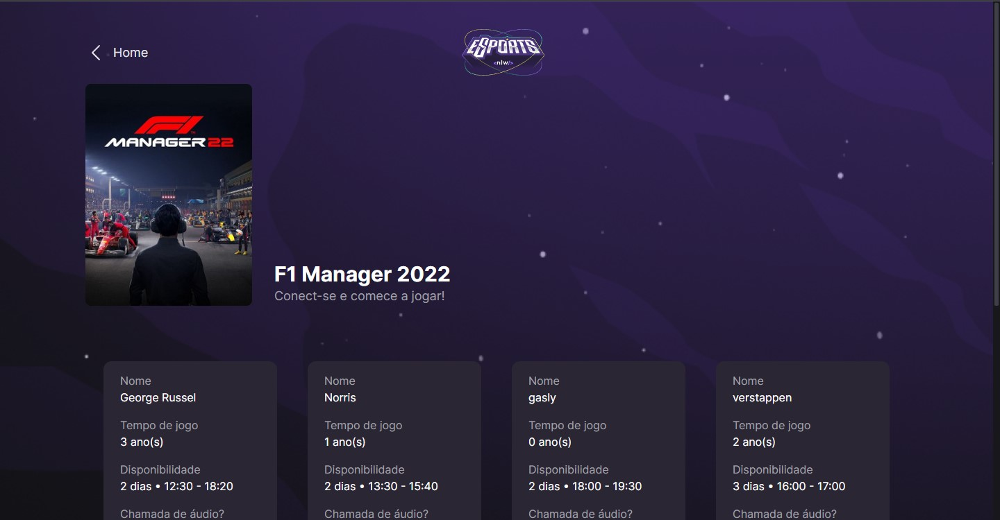
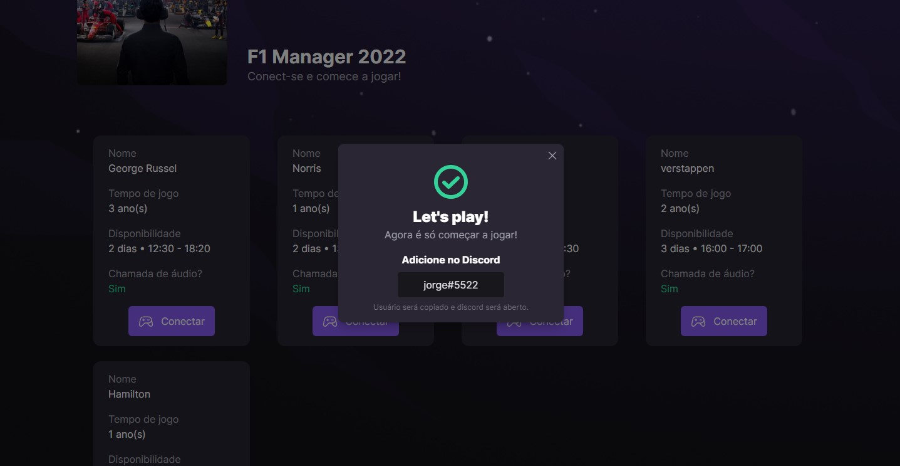
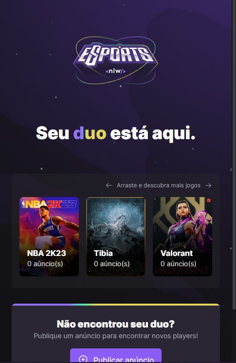
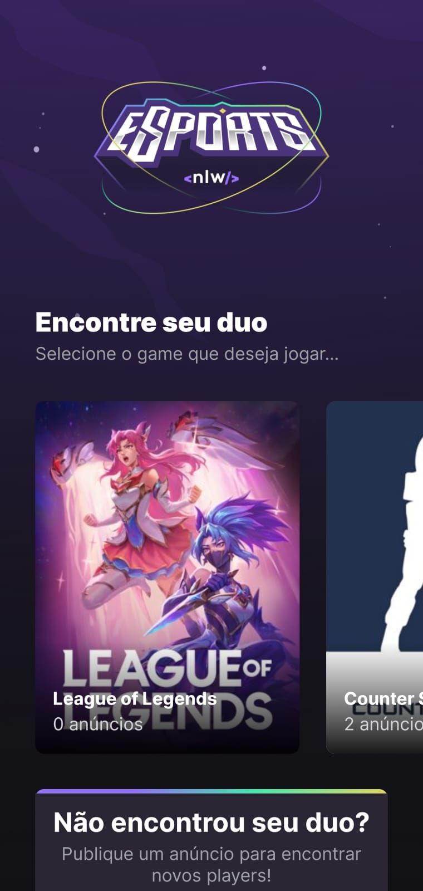
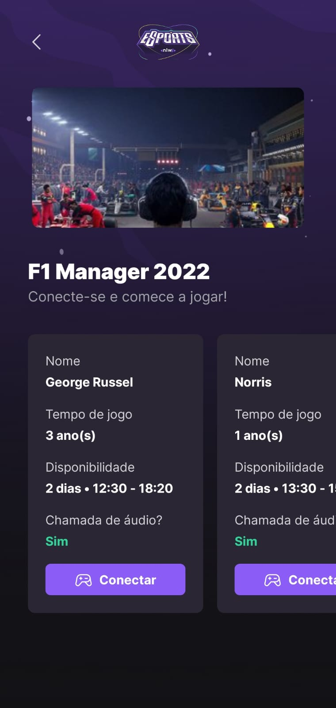

<p align="center" >
    
</p>
<div align="center" >
    
    
    
</div>
<div align="center">
    
    
    
</div>

# NLW eSports - Ignite 🚀
Projeto desenvolvido em conjunto com a [Rocketseat](https://www.rocketseat.com.br/) durante a Next Level Week eSports, trilha Ignite, entre os dias 11/09/2022 e 18/09/2022.

## 💻 Projeto 
- O projeto se baseia em tornar mais acessível encontrar parceiros para jorgar juntos jogos multiplayer. Através da criação de anúncios que ficam visíveis para quem entrar no site/app.
- O anúncio possui informações importantes para o usuário escolher e entrar em contato.
- Servidor estático, os jogos foram adicionados.

## 🧪 Tecnologias
- React
- React Native
- NodeJS
- TailWind CSS
- Phosphor Icons
- Prisma
- Vite
- Kenn Slider
- Radix UI
- Axios

## 🛠️ Melhorias adicionadas
> ### 💻 Web 
> - Responsividade.
> - Criação de página de visialização de anúncios.
> - Gerenciamento de rotas da aplicação.
> - Melhorias de parte do código com a biblioteca `Radix UI`.
> - Validação simples do formulário, apenas para não passar em branco.
> - Página 404.
> ### ⚙️ Server
> - Implementação de requisição para pegar dados sobre o Game (Nome e URL do banner).

## 🔮 Layout
Acesse o layout do projeto através do [Figma](https://www.figma.com/community/file/1150897317533332617).

## 📄Como executar

Faça o download das dependências nas pastas `web`, `mobile` e `server`.
```bash
$ npm install
```
- Na pasta `mobile` crie um arquivo `.env` com o endereço IP de sua máquina
```bash
SERVER_URL="http://000.000.00.00:0000"
```
- Na pasta `server` crie um `.env` com o caminho do `dev.db` do seu database de desenvolvimento na pasta `prisma`.
```bash
DATABASE_URL="file:./dev.db"
```
- Para por o `server` no ar rode no terminal
```bash
npm run dev
```
- Para rodar versão `web`
```bash
npm run dev
```
- Usar versão `mobile` com expo
```bash
expo start
```
